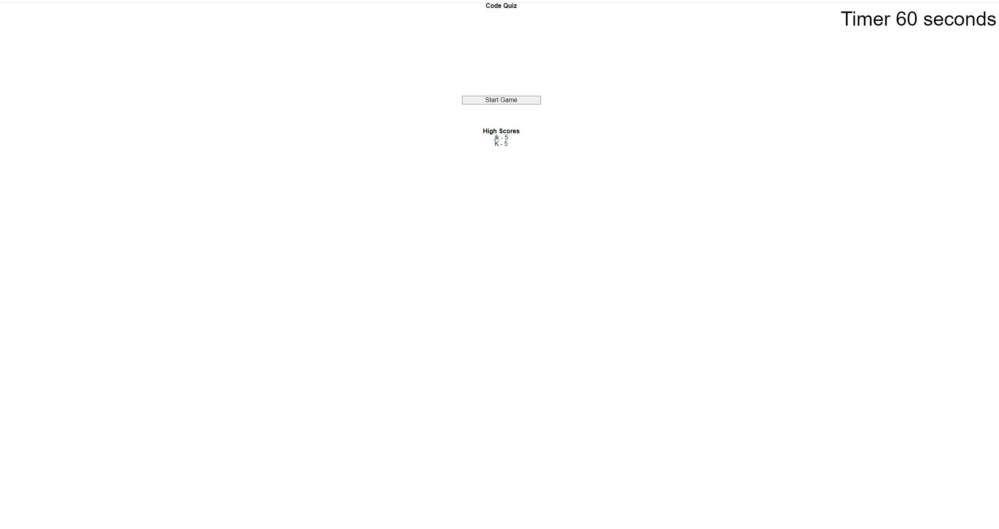

# coding-quiz

## Technology Used 
N/A
  
## Description 
This is a coding quiz designed to test your knowledge on basic css, javascript, and html. 5 questions long more possibly to come as it is a work in progress. you can visit the deployed site [here.](https://jacob-kachmarek.github.io/coding-quiz/)  Here is a picture of the deployed website. 

## Installation
N/A 

## Usage 
Click the start game button, when the question pops up click the answer box you feel best answers the question prompt. At the end you will be asked to give your initials if you would like to save your score. If you refresh the page your scores should still be displayed.

## Learning Points 
N/A

## Author Info
Jacob Kachmarek
 [Github](https://github.com/jacob-kachmarek)
 [Portfolio](https://jacob-kachmarek.github.io/jacob-kachmarek-portfolio/)
 [Linkedin](https://www.linkedin.com/in/jacob-kachmarek/)

## Credits
N/A

## License
N/A

## Badges
N/A

## Features
N/A

## Contributing
N/A

## Tests
N/A